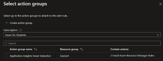

## Azure Service Health

**No tiene SLA**

- **Modelo de servicio:** SaaS
- **Funcion:** Para checar la salud del servicio
- **Funcion:** Avisa de mantenimientos programados
- **Funcion:** úedes ver si un servicio de Azure esta fallando en la region o nivel global
- **Cuando usar:** La primera parada si algo falla.

-----------------------------------------------------------------------------------------------------------------------------------

### Pasos para crear una alerta de Service Health

1.- Nos vamos al [Portal Azure](portal.azure.com)

2.- Buscamos service Health

3.- Aca podemos seleccionar de nuestra subscripcion,y ver que servicios estan fallando.

4.- Vamos a añadir una alerta, es decir azure nos mandara un correo cuando este fallando.

5.- Vamos a ir rellenado lo que buscamos que haga este 

6.- En acciones, vamos a crear un grupo de acciones, en este no se ocupa una region ya que esta en todo el mundo

7.- Nos vamos a la parte de Notificaciones y agregamos como queremos que nos llegue la notificacion.

8.- Ahora le damos en reviar y crear

9.- Le damos grupo de **acciones de prueba** 

10.- le damos en prueba y esperemos a que se ejecute.

11.- Una ves que se ejecute, nos vamos a nuestro correo y ahi aparecera la notificacion.

 En la seccion de mantenimiento planeaod es avisos de algo que esta programado.
 Avisos de estado, son los problemas de seguridad y tambien esta el historial de las fallas, Esto es Azure Service Health.

-----------------------------------------------------------------------------------------------
